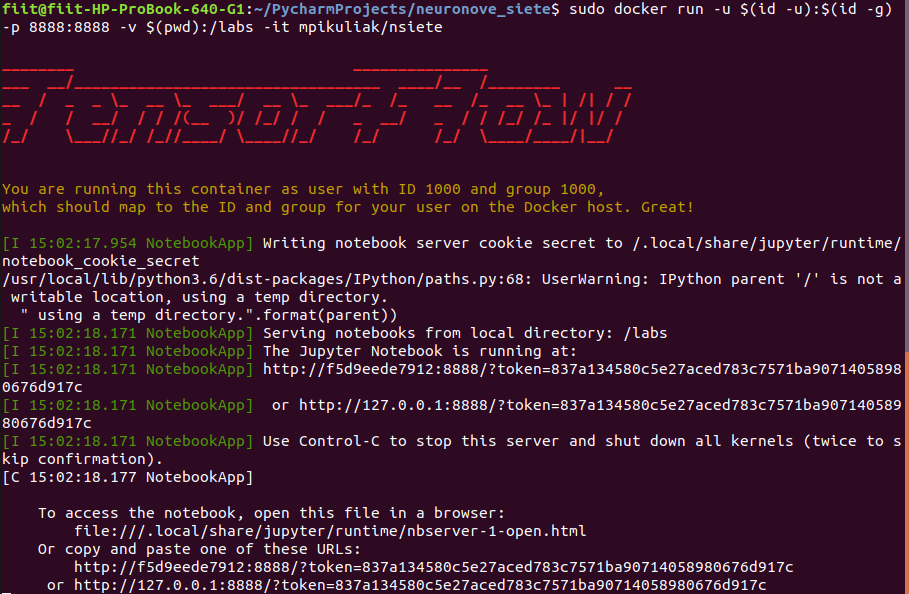

# Neural Networks at FIIT

## Environment setup

1. [Install docker](https://docs.docker.com/install/).
This should be easy for UNIX based systems.
On Windows you might need to enable the virtualization in your BIOS

2. Clone this repository:

    `git clone https://github.com/matus-pikuliak/neural_networks_at_fiit`

3. Use docker to download the image we will use for the labs
(Use `sudo` on UNIX based systems):

    `docker pull mpikuliak/nsiete`

4. From your repository folder, run the image as a container:

    For UNIX based systems:

    `docker run -u $(id -u):$(id -g) -p 8888:8888 -v $(pwd):/labs -it mpikuliak/nsiete`

    For Windows:
    
    `docker run -p 8888:8888 -v c:/path/to/repo:/labs -it mpikuliak/nsiete`
    
    You should only change the `c:/path/to/repo`. Leave the `:/labs` at the end of `-v` flag there.

    You should see something like this:

5. Open the last link from the console `127.0.0.1:8888/?token=...` in your browser.
You should see the folders from this repository including `week_1` folder with `.ipynb` Notebook.
If you can run this notebook you should be all set.